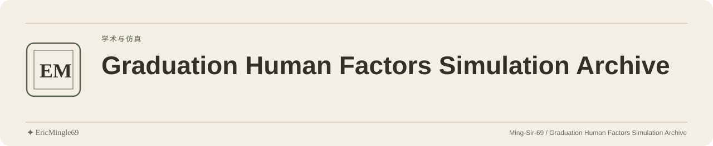

<picture>
  <source media="(prefers-color-scheme: dark)" srcset="readme-assets/header-dark.svg">
  <source media="(prefers-color-scheme: light)" srcset="readme-assets/header-light.svg">
  
</picture>

  <a href="README.md">简体中文</a> · <a href="README.en.md">English</a> · <a href="PERSONAL-NOTICE.md">✦ EricMingle69</a>

# Graduation Human Factors Simulation Archive

## Purpose

A guide to graduation human factors simulation scripts, method notes, parameter tables and historical results, held under `01仿真数据/`.

## Repository guide

| Entry | Contents |
| --- | --- |
| [Structure guide](01仿真数据/文件结构.md) | Uses the historical top-level name “仿真3.0”; repository paths take precedence |
| [Simulation methods](01仿真数据/1仿真总结/仿真方法/) | Method and workflow documents |
| [Data loading](01仿真数据/数据加载.py) | Research script entry |
| [Orthogonal design](01仿真数据/正交设计.py) | Research script entry |
| [Combined calculations](01仿真数据/综合计算.py) | Research script entry |
| [Historical results](01仿真数据/结果/) | Stored calculation outputs |
| [Simulation summaries](01仿真数据/1仿真总结/) | Research notes and historical outputs |

## Getting started

1. Start with the structure guide and simulation methods, then read the three Python entries.
2. Before reproduction, establish Python/library versions, execution order, parameter provenance and model assumptions.
3. Parameter directories and historical results help locate material; filenames alone do not establish valid data.

## Scope and limitations

- This is a research archive without a dependency list or unified startup guide.
- The provenance, authorship, applicability and sharing rights of anthropometric and other parameter tables are unspecified.
- Simulation results require independent review and must not be used directly for human safety decisions.

## Sources and existing licenses

Retain the attribution of research participants, data authors and cited material. The original repository provides no LICENSE/NOTICE; rights for code, parameters and research material need separate confirmation.

---

Documentation maintained by **✦ EricMingle69** · [Ming-Sir-69](https://github.com/Ming-Sir-69)  
[Personal identity, licensing and permissions](PERSONAL-NOTICE.md) · The header follows your GitHub theme.
